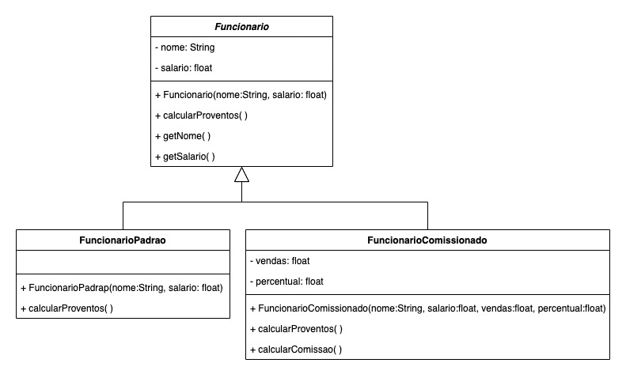

# Classe Abstrata

Desenvolver um programa para cadastrar os funcionários de uma empresa e calcular os proventos devidos a cada um deles por um mês de trabalho.

- Proventos: representam quaisquer valores devidos aos funcionários a título de remuneração.
- Serão considerados apenas dois tipos de proventos:
- Salário Fixo: devido a todos os funcionários.
- Comissão: adicional devido pelas vendas realizadas pelos funcionários que são comissionados.
- Diagrama de Classes

